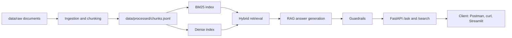
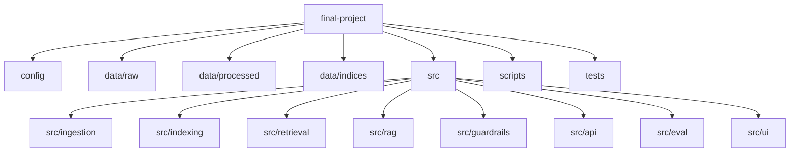
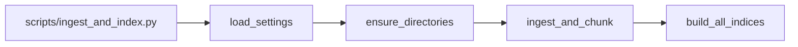
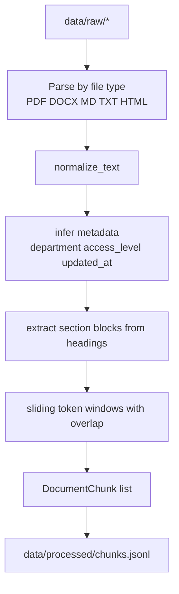
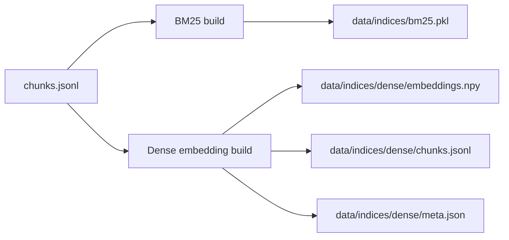
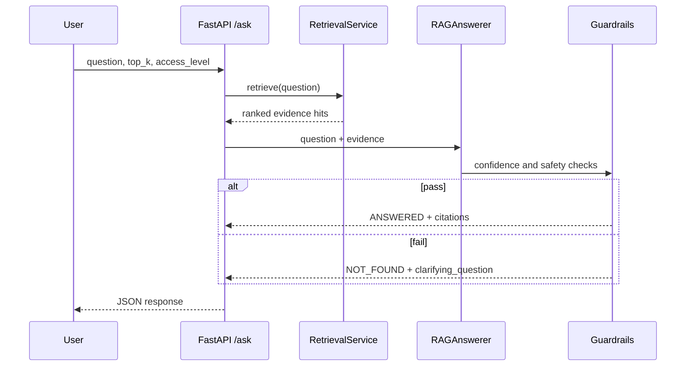
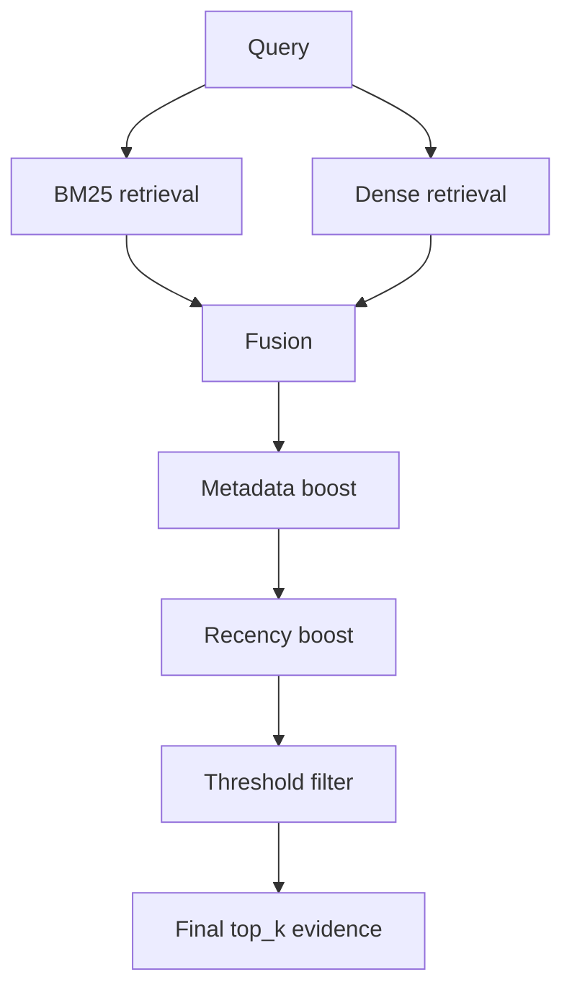
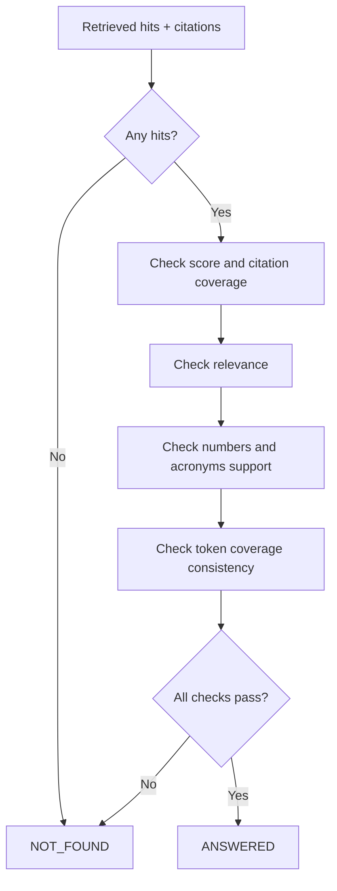
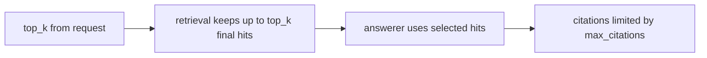
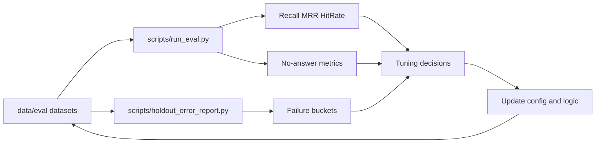

# Beginner Project Diagrams

This guide explains how the project works end to end for a first-time contributor.

Project: `Vietnamese Internal Docs RAG Assistant`  
Core idea: the system answers only from indexed internal documents, with citations.

## 1) Big Picture



What this means:
- Build-time path: `data/raw -> chunks -> indices`
- Runtime path: `question -> retrieve -> answer -> guardrails -> API response`

## 2) Repository Map (What Each Folder Does)



## 3) Build-Time Pipeline (How Knowledge Is Prepared)

### 3.1 Entry Script



### 3.2 Ingestion and Chunking



Important outputs per chunk:
- `doc_id`
- `chunk_id`
- `text`
- `title`
- `section_path`
- `department`
- `updated_at`
- `access_level`

### 3.3 Index Building



## 4) Runtime Query Flow (`POST /ask`)



## 5) Retrieval Internals



Notes:
- BM25 is lexical (keyword-based).
- Dense is semantic (embedding similarity).
- Hybrid is usually stronger than either one alone.

## 6) Guardrail Decision Logic (Simplified)



## 7) Why `top_k` Matters



Key distinction:
- `top_k`: number of final retrieval hits considered.
- `max_citations`: maximum citations shown in answer.

## 8) Evaluation and Tuning Loop



## 9) First-Day Runbook (Beginner)

1. Install dependencies:
```bash
python3 -m venv .venv
source .venv/bin/activate
pip install -r requirements.txt
```

2. Build chunks and indices:
```bash
PYTHONPATH=. DISABLE_EXTERNAL_MODELS=1 python3 scripts/ingest_and_index.py --config config/default.yaml
```

3. Start API:
```bash
PYTHONPATH=. DISABLE_EXTERNAL_MODELS=1 python3 scripts/run_api.py --config config/default.yaml
```

4. Smoke check:
```bash
curl -s http://127.0.0.1:8000/health
```

5. Ask one question:
```bash
curl -s -X POST http://127.0.0.1:8000/ask \
  -H 'content-type: application/json' \
  -d '{"question":"Cho tôi biết về đặt tên nhánh","top_k":5,"access_level":"public"}'
```

## 10) Debug Checklist for New Contributors

- If answer is `NOT_FOUND` unexpectedly:
  - Retry with `"debug": true`.
  - Check top retrieved `chunk_id` in debug output.
  - Check whether citation coverage or relevance thresholds rejected it.
- If retrieval is poor:
  - Rebuild corpus and indices.
  - Inspect chunk quality in `data/processed/chunks.jsonl`.
  - Compare BM25 vs dense top hits in `/search?debug=true`.
- If API fails:
  - Confirm indices exist in `data/indices/`.
  - Confirm config path and env vars are correct.

