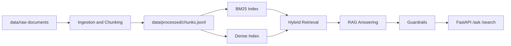
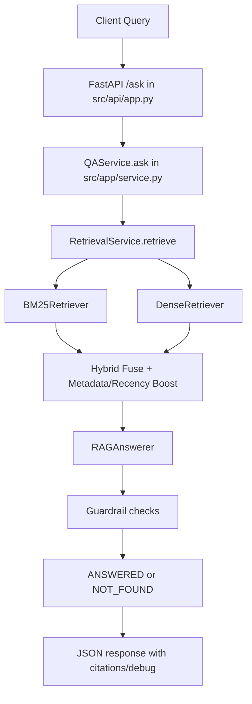
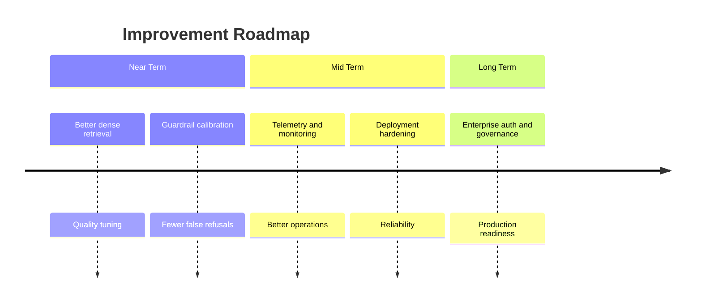

# Vietnamese Internal Docs RAG Assistant
## Executive Project Report (2-3 Pages)

**Prepared on:** March 3, 2026  
**Project type:** Local-first Retrieval-Augmented Generation (RAG) QA system  
**Primary objective:** Answer internal policy questions with evidence-backed citations and safe refusal behavior.

---

## 1) Executive Summary

This project delivers a complete end-to-end Vietnamese QA assistant for internal enterprise documentation. Instead of relying on free-form language generation, the system first retrieves relevant evidence from indexed documents, then generates an answer constrained by that evidence, and finally applies guardrails to decide whether the answer is sufficiently supported.

The core value is reliability: users receive either:
- `ANSWERED` with citations pointing to exact document chunks, or
- `NOT_FOUND` when support is insufficient.

This strict contract reduces hallucination risk and improves trust in enterprise settings where policy accuracy matters.

The implementation is operational and demo-ready, including:
- ingestion for common document formats,
- hybrid retrieval (BM25 + dense),
- FastAPI endpoints,
- Streamlit UI,
- automated evaluation scripts,
- manual scenario checklist.

---

## 2) Problem and Motivation

Internal policy knowledge is fragmented across many documents and departments (HR, Engineering, Security, Operations). Typical pain points are:

1. Manual lookup is slow and inconsistent.
2. Users may miss the correct section or latest applicable rule.
3. Ungrounded LLM answers can appear fluent but be unsupported.

For academic and practical relevance, this project focuses on building a system that is both useful and defensible:
- useful because it can answer real policy questions quickly,
- defensible because every accepted answer is traceable to explicit evidence.

---

## 3) Solution Overview

The system uses a three-layer design:

1. **Knowledge preparation layer**  
   Raw files are parsed, cleaned, chunked, and indexed.

2. **Retrieval + answering layer**  
   Hybrid retrieval finds candidate evidence; answerer builds response text from that evidence.

3. **Guardrail decision layer**  
   Confidence and support checks determine whether to return `ANSWERED` or `NOT_FOUND`.

---

## 4) Implementation Details

### 4.1 Runtime profile and configuration
The system behavior is driven by `config/default.yaml`, loaded by `src/config/settings.py`. The current baseline is intentionally deterministic:
- `llm_backend = heuristic`
- `embedding_model_name = hash://384`
- `default_top_k = 5`
- `fusion_method = weighted` with `lexical_weight = 0.62`, `dense_weight = 0.38`
- retrieval thresholds: `min_score_threshold = 0.18`, `min_relative_score = 0.35`, `min_query_token_overlap = 0.05`
- guardrails: `min_citation_coverage = 0.34`, `min_citation_relevance = 0.08`, `min_top_relevance = 0.08`, `max_citations = 3`

### 4.2 Build-time pipeline internals
Build-time processing is implemented mainly in `src/ingestion/pipeline.py`, `src/indexing/chunker.py`, and `src/indexing/build_indices.py`:
1. Parse raw files (`PDF`, `DOCX`, `MD`, `HTML`, `TXT`) via `src/ingestion/parsers.py`.
2. Normalize text (`src/ingestion/cleaning.py`) using Unicode/whitespace cleanup.
3. Infer metadata from filename:
   - `department` (`HR`, `Engineering`, `Security`, `General`)
   - `access_level` (`public`, `internal`, `restricted`)
   - `updated_at` (date pattern or fallback `1970-01-01`)
4. Build section-aware token windows:
   - `chunk_size_tokens = 350`
   - `overlap_tokens = 80`
   - deterministic `chunk_id = {doc_id}-{idx}-{md5[:8]}`
5. Persist chunk corpus to `data/processed/chunks.jsonl`.

### 4.3 Index construction internals
Index artifacts are built from `chunks.jsonl`:
- **BM25 index** (`src/indexing/bm25_index.py`): lexical scoring over chunk text + metadata text.
- **Dense index** (`src/indexing/dense_index.py`): vector embeddings (default hash backend) stored under `data/indices/dense`.
- Orchestration (`src/indexing/build_indices.py`) writes:
  - `data/indices/bm25.pkl`
  - dense embedding artifacts (`embeddings`, metadata, chunk rows).

### 4.4 Runtime execution path (vertical view)

### 4.5 Hybrid retrieval logic
`src/retrieval/service.py` performs retrieval in six stages:
1. Retrieve candidates from BM25 and dense retrievers with `candidate_size = max(24, top_k*3, 10)`.
2. Compute query-adaptive weights:
   - bias toward lexical when query has acronyms/numbers/code-like tokens,
   - bias toward dense when query is long (>=10 tokens).
3. Fuse scores (`src/retrieval/hybrid.py`) using weighted combination.
4. Apply recency boost from `updated_at`.
5. Apply metadata boost from `title` and `section_path` overlap.
6. Filter by threshold + relative score + token-overlap constraints.

### 4.6 Answering and guardrail decision engine
Answer generation (`src/rag/answerer.py`, `src/rag/local_llm.py`) and refusal logic (`src/guardrails/policy.py`) are coupled:
- Heuristic backend synthesizes bullet answers from retrieved chunks (citation-grounded).
- Citation filtering ranks candidate citations using score, overlap, title/section phrase match.
- Guardrail checks include:
  - top-score and citation-coverage thresholds,
  - token relevance in chunk text and metadata,
  - yes/no-query strictness,
  - numeric token support,
  - acronym support,
  - open-query content coverage.
- Final contract is strict:
  - supported: `status = ANSWERED` with citations
  - unsupported/insufficient: `status = NOT_FOUND` + clarifying question

### 4.7 Debug and verification hooks
When `debug=true`, `/ask` and `/search` expose:
- top BM25 candidates,
- top dense candidates,
- fusion weights and candidate size,
- active threshold values,
- internal support features (coverage/relevance values).

These traces are used for reproducible tuning and regression-proof fixes (especially for conversational Vietnamese phrasing).

---

## 5) API and User Interface

Implemented API endpoints:
- `GET /health`
- `POST /search`
- `POST /ask`

Behavioral contract:
- `/ask` returns only `ANSWERED` or `NOT_FOUND`.
- Debug mode can expose retrieval and threshold traces for explainability.

User-facing access:
- Streamlit app for interactive demo/testing.
- Postman/curl support for API-level validation.

---

## 6) Evaluation Results (Current Baseline)

Baseline profile (default config):
- `llm_backend = heuristic`
- `embedding_model_name = hash://384`
- weighted hybrid retrieval (`lexical 0.62`, `dense 0.38`)

Verified metrics:
- **BM25:** Recall@5 `1.0`, MRR `0.9778`
- **Dense (hash):** Recall@5 `0.1222`, MRR `0.0526`
- **Hybrid:** Recall@5 `1.0`, MRR `0.9944`
- **No-answer behavior:** precision `1.0`, recall `1.0`, F1 `1.0`

Interpretation:
- Hybrid retrieval is the strongest operational mode.
- Dense hash embeddings alone are weaker semantically.
- Guardrail refusal behavior is conservative and consistent.

---

## 7) Quality Assurance and Robustness

Validation strategy combines:

1. Unit/integration tests for chunking, retrieval, guardrails, API contract.
2. Manual scenario checklist (20 cases) for realistic QA behavior.
3. One-command verification pipeline for rebuild/tests/eval/API smoke checks.

A notable improvement cycle was completed on conversational Vietnamese queries:
- observed false refusal on certain natural phrasing,
- diagnosed via debug traces,
- updated relevance logic and added regression tests,
- confirmed stable `ANSWERED` behavior without relaxing safety globally.

This demonstrates engineering maturity: diagnose, patch, test, re-verify.

---

## 8) Current Limitations

Despite strong baseline behavior, the system is still MVP-stage for production:

1. Dense retrieval quality is limited by hash embedding default.
2. Chunking is token-window-based, not fully sentence-boundary-aware.
3. Guardrails can still be strict on borderline queries.
4. Production features (auth integration, observability, deployment hardening) remain future work.

---

## 9) Roadmap

Near-term:
- improve dense semantic retrieval quality while preserving reproducibility,
- tune guardrail calibration to reduce residual false refusals,
- strengthen runtime diagnostics and refusal telemetry.

Mid/long-term:
- add enterprise access/governance controls,
- deploy observability stack and reliability safeguards,
- expand evaluation datasets for broader policy coverage.

---

## 10) Conclusion

This project successfully implements a practical and technically coherent Vietnamese internal-policy QA assistant with:
- end-to-end architecture,
- citation-grounded answering,
- strict safe-refusal behavior,
- measurable retrieval and guardrail quality,
- reproducible evaluation and demo workflow.

For academic assessment, the project demonstrates strong system design, engineering rigor, and evidence-driven iteration. It is suitable as a defensible MVP and a solid foundation for production-oriented expansion.
