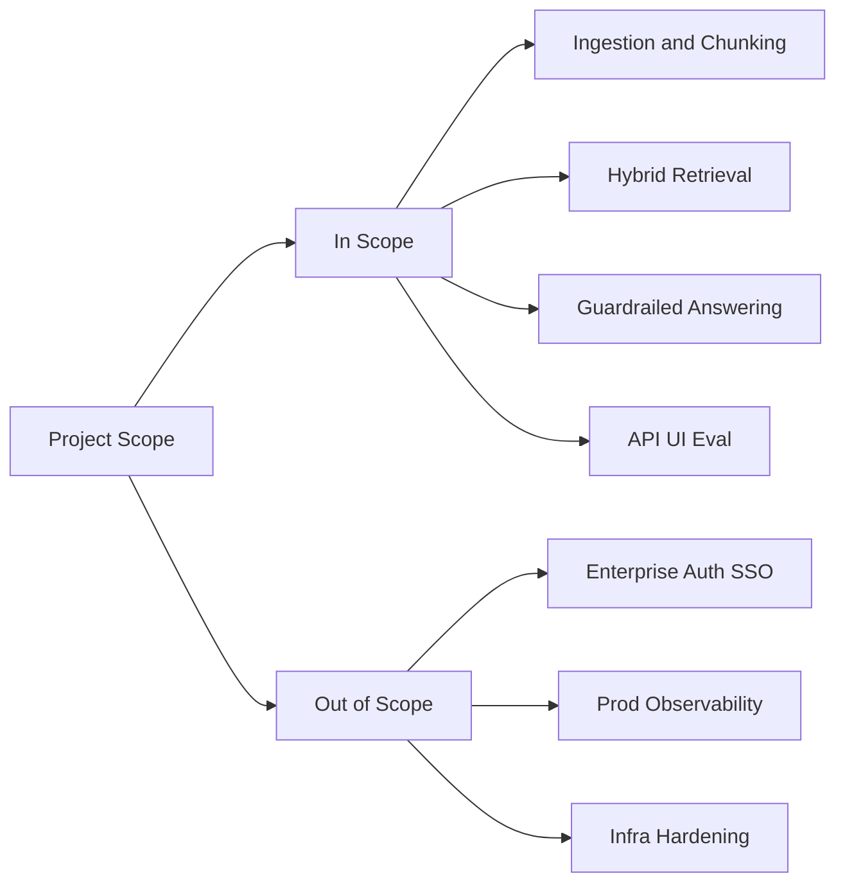
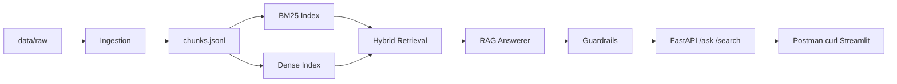
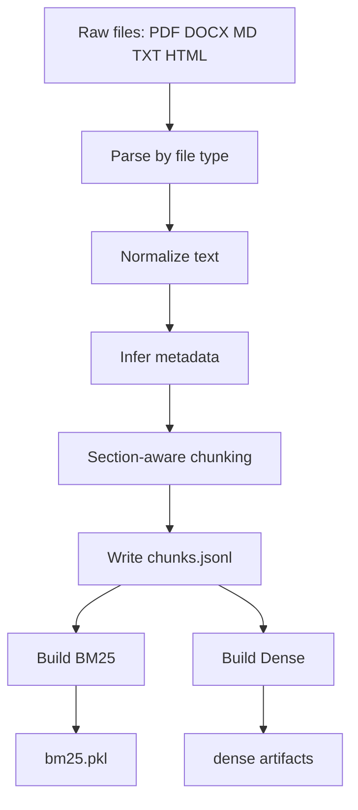
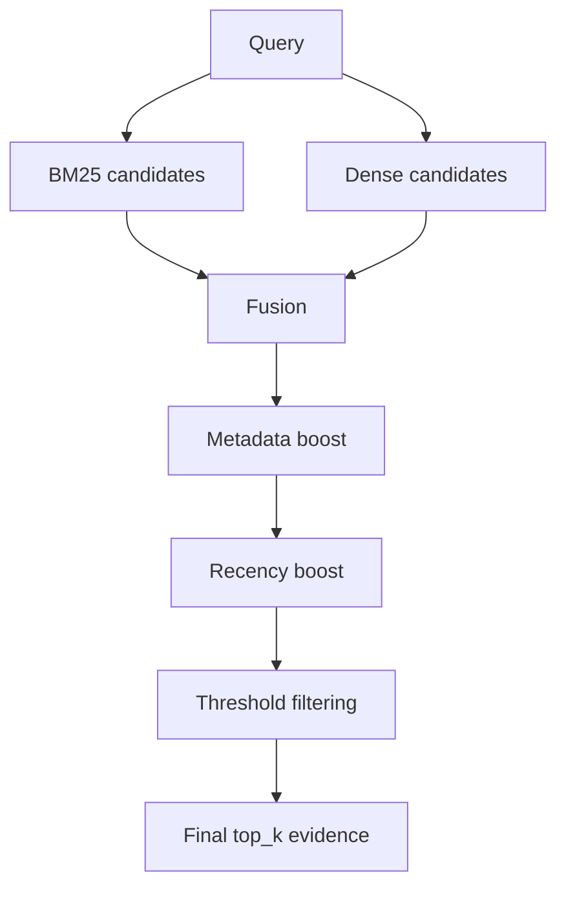
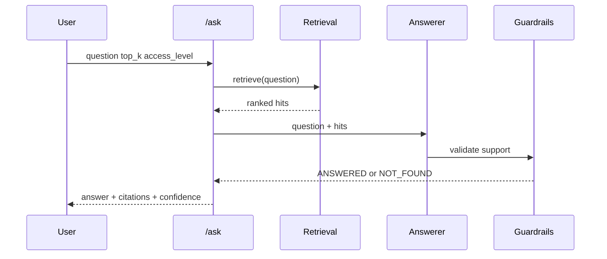
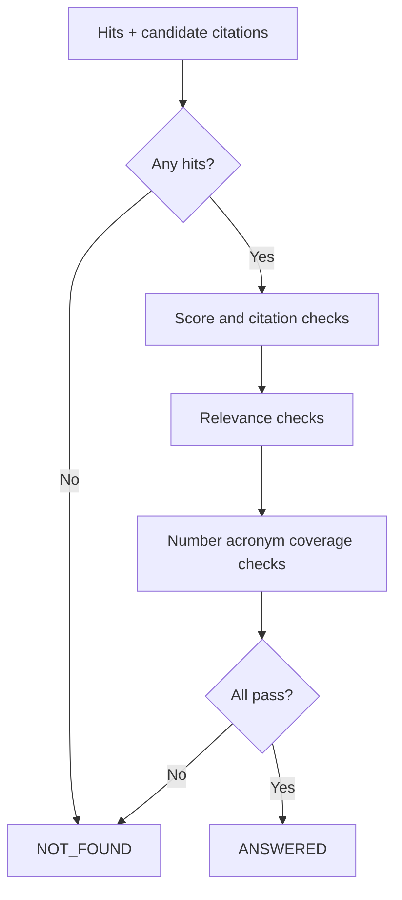
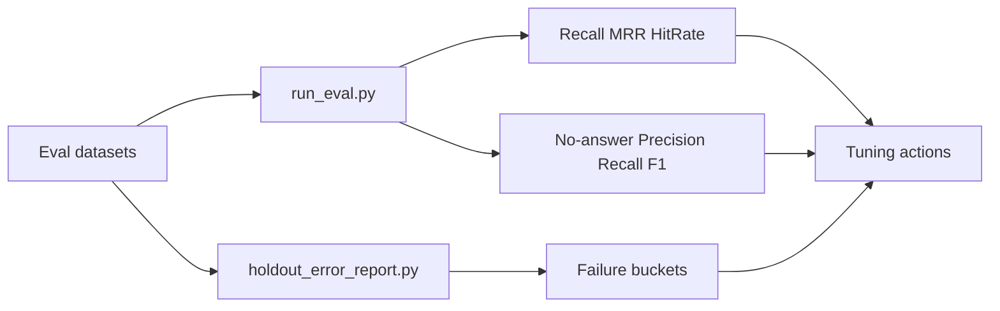
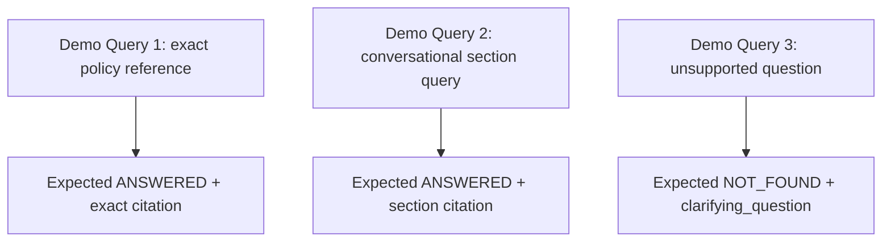
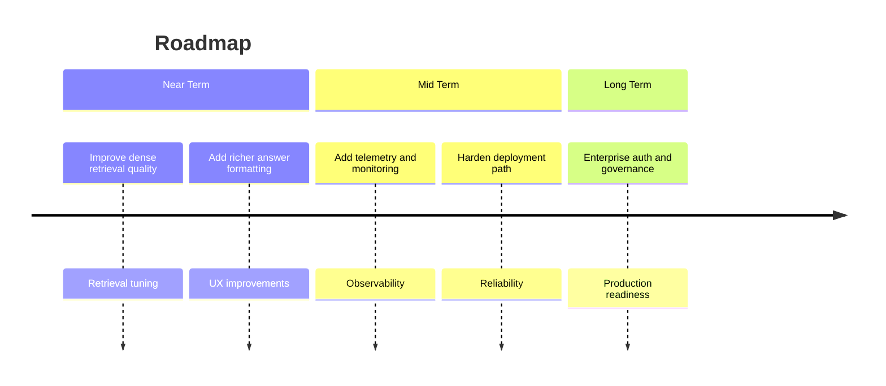

# 11-Slide Presentation Plan (Markdown + Mermaid) for Project Onboarding and Technical Walkthrough

This deck is designed for a 12-15 minute technical presentation in architecture-first walkthrough style.

## Slide 1 — Problem and Motivation

### Objective
Establish why a citation-grounded internal QA assistant is needed for policy-heavy organizations.

### On-Slide Content
- Internal policy knowledge is fragmented across HR, Engineering, Security, and Operations documents.
- Manual searching is slow and inconsistent, while unguided LLM output can hallucinate.
- This project goal is to deliver grounded answers with citations and safe refusal when unsupported.

### Diagram


### Speaker Notes (60–90 sec)
Start with the user pain, not the model. Explain that employees usually ask policy questions under time pressure, but policies are spread across many documents with different formats and update times. Emphasize two failure modes of the old workflow: people cannot find the right section fast enough, and they may trust an ungrounded AI answer that sounds correct but is not backed by internal policy. Transition to the project objective: this assistant is designed to answer only from indexed internal documents, include citations in every supported answer, and return `NOT_FOUND` with clarification when evidence is insufficient.

## Slide 2 — Project Scope and Outcomes

### Objective
Clarify what the current implementation solves today and what is intentionally out of scope.

### On-Slide Content
- In scope: ingestion, indexing, hybrid retrieval, guardrails, FastAPI endpoints, UI integration, and evaluation scripts.
- Out of scope for this phase: enterprise authentication, production observability stack, and deployment hardening.
- Outcome: a complete MVP suitable for coursework demo and controlled prototype use.

### Diagram


### Speaker Notes (60–90 sec)
Set expectations early to avoid scope confusion. State that the repository already implements full end-to-end functionality from document ingestion to API response, including evaluation and manual QA scenarios. Then clearly separate MVP goals from production goals: enterprise auth and deep monitoring are not solved here yet. This framing helps reviewers evaluate the project on the correct criteria: technical coherence, retrieval quality, safety behavior, and reproducible testing. Transition to architecture: now that scope is clear, walk through how the system is built.

## Slide 3 — End-to-End System Architecture

### Objective
Give a complete mental model of the online and offline components in one view.

### On-Slide Content
- Offline path prepares searchable knowledge: `data/raw -> chunks -> BM25 + dense indices`.
- Online path serves user requests: retrieval, answer generation, guardrails, then API response.
- The same chunk corpus powers both BM25 lexical and dense semantic retrieval branches.

### Diagram


### Speaker Notes (60–90 sec)
Walk left to right and explicitly separate build-time from query-time. Explain that ingestion produces deterministic chunks, then two retrieval indices are built from the same chunk records. During runtime, retrieval merges BM25 and dense evidence, then the answerer packages candidate content into response text with citations, and guardrails make the final safety decision. Mention deployed interfaces: `/ask` and `/search` through FastAPI, consumable by Postman, curl, or Streamlit. Transition to slide 4 by saying: next, we zoom into how raw documents become chunks and indices.

## Slide 4 — Build-Time Data Pipeline

### Objective
Explain step-by-step how heterogeneous internal files become structured retrieval artifacts.

### On-Slide Content
- Supported formats are parsed, normalized, and enriched with metadata (`department`, `access_level`, `updated_at`).
- Section-aware chunking with overlap creates deterministic `DocumentChunk` records.
- Outputs are persisted as `chunks.jsonl`, `bm25.pkl`, and dense artifacts for runtime retrieval.

### Diagram


### Speaker Notes (60–90 sec)
Describe this as the knowledge preparation phase. Parsing handles multiple file formats into unified text; normalization reduces noise; metadata inference supports filtering and ranking; section-aware chunking preserves structural meaning like policy headers. Then explain outputs: chunk corpus in `data/processed/chunks.jsonl`, lexical index in `data/indices/bm25.pkl`, and dense embeddings/meta in `data/indices/dense/`. Reinforce why determinism matters: stable chunk IDs improve debugging, testing, and citation consistency. Transition to retrieval internals: once artifacts exist, how do we rank evidence for a new question?

## Slide 5 — Retrieval Engine (BM25 + Dense + Hybrid)

### Objective
Show how lexical and semantic retrieval are combined into a robust ranking pipeline.

### On-Slide Content
- BM25 captures exact keywords and technical terms; dense retrieval captures semantic similarity.
- Hybrid fusion combines both branches, then applies metadata and recency boosts.
- Final threshold filters enforce relevance quality before evidence reaches the answerer.

### Diagram


### Speaker Notes (60–90 sec)
Introduce retrieval as the quality bottleneck: if evidence is wrong, generation cannot recover. Explain BM25 strengths (precision on explicit policy phrases, acronyms, numbers) and dense strengths (paraphrase tolerance). Then explain hybrid ranking and post-fusion calibrations: metadata boost helps section/title-aligned queries; recency boost prefers newer documents when relevant; threshold filters prevent weak candidates from leaking into downstream answer generation. Tie this to observed metrics later: hybrid significantly outperforms dense-only in this baseline. Transition to runtime lifecycle.

## Slide 6 — Runtime `/ask` Lifecycle

### Objective
Describe what happens from API request to final JSON response.

### On-Slide Content
- Request includes `question`, optional `top_k`, and `access_level` (plus optional debug flag).
- Retrieval returns ranked hits, then answerer composes response text with citations.
- Guardrails finalize either `ANSWERED` or `NOT_FOUND` before API returns JSON.

### Diagram


### Speaker Notes (60–90 sec)
Walk through a single request lifecycle to unify prior concepts. Mention that `/ask` is grounded by retrieved evidence, not free generation. Clarify that `top_k` controls how many final retrieval hits are considered, while citation count is governed separately by guardrail settings. Explain the response contract fields: `answer`, `citations`, `confidence`, `status`, and optional `clarifying_question`. Highlight strict status behavior: only `ANSWERED` or `NOT_FOUND`. Transition to guardrails by asking: what exact checks decide between these two statuses?

## Slide 7 — Guardrails and Decision Logic

### Objective
Explain how the system enforces safety and support quality before returning an answer.

### On-Slide Content
- Core checks: evidence existence, score strength, citation relevance, and coverage thresholds.
- Semantic consistency checks include numbers, acronyms, and token-coverage support.
- Decision is strict: unsupported or weakly supported outputs become `NOT_FOUND`.

### Diagram


### Speaker Notes (60–90 sec)
Frame guardrails as policy enforcement for trustworthiness. First pass checks look for basic support quality: non-empty hits, acceptable score, and sufficient citation coverage. Second pass checks catch subtle mismatch: unsupported numeric claims, acronym drift, and weak token coverage. Emphasize tradeoff: strict guardrails reduce hallucination risk but can create false refusals on borderline phrasing. This tradeoff leads naturally to slide 9 case study. Transition first through objective metrics to show the baseline impact.

## Slide 8 — Evaluation and Metrics

### Objective
Show how system quality is measured and how tuning decisions are driven by evidence.

### On-Slide Content
- Retrieval metrics: Recall@k, MRR, and evidence hit rate for BM25, dense, and hybrid.
- Guardrail metrics: no-answer precision, recall, and F1 to track refusal quality.
- Error buckets feed iterative tuning across retrieval logic and guardrail behavior.

### Diagram


### Speaker Notes (60–90 sec)
Anchor quality discussion in reproducible metrics from scripts, not intuition. Mention current verified baseline on sample corpus: BM25 and hybrid achieve strong recall/MRR, dense hash backend is weaker semantically, and no-answer metrics are strong under current strict policy. Explain why these metrics matter together: retrieval quality alone is not enough; refusal calibration must also be accurate. Then transition to concrete tuning story: one realistic false-refusal case and how it was fixed without lowering safety globally.

## Slide 9 — Case Study: False Refusal Fix

### Objective
Demonstrate practical debugging and targeted guardrail improvement using a real query failure.

### On-Slide Content
- Before fix: conversational query like “cách đặt tên nhánh” could return `NOT_FOUND`.
- Root causes: overlap score brittleness and metadata relevance dilution from combined text.
- After fix: dynamic overlap scoring + `max(title, section, combined)` metadata relevance restored stable `ANSWERED`.

### Diagram
```mermaid
flowchart LR
    A[Before fix] --> B[Conversational query adds filler tokens]
    B --> C[Overlap score drops below threshold]
    C --> D[False NOT_FOUND]
    D --> E[After fix]
    E --> F[Dynamic overlap scoring]
    E --> G[Metadata relevance uses max(title section combined)]
    F --> H[Stable ANSWERED for natural phrasing]
    G --> H
```

### Speaker Notes (60–90 sec)
Present this as engineering rigor in action. The system retrieved the correct chunk, but guardrail scoring rejected it for some conversational phrasings. We fixed this by making overlap scoring dynamic and by computing metadata relevance as the maximum of title, section path, and combined metadata, instead of relying on a single diluted combined score. Emphasize validation: regression tests were added for conversational phrasing stability and anti-overboost safety, and full test suite remained green. Transition to demo: now show what audience should expect in practice.

## Slide 10 — Demo Plan and Expected Responses

### Objective
Provide a clear live-demo script and expected outputs for reliable presentation delivery.

### On-Slide Content
- Demo Query 1 (exact reference): expected `ANSWERED` with exact target citation.
- Demo Query 2 (conversational section query): expected `ANSWERED` with section citation after fix.
- Demo Query 3 (unsupported question): expected `NOT_FOUND` with clarifying prompt.

### Diagram


### Speaker Notes (60–90 sec)
Explain demo strategy as coverage of three behaviors: precision answer, conversational robustness, and safe refusal. Recommend running with default config and rebuilt indices before presentation. For each query, emphasize what to verify quickly on screen: status, confidence, and presence/absence of expected citation IDs. This keeps the demo objective and auditable. Transition to closing by summarizing current maturity and what comes next for production-level readiness.

## Slide 11 — Limitations, Roadmap, and Q&A

### Objective
Conclude with honest limitations, pragmatic next steps, and discussion prompts.

### On-Slide Content
- Current limitations: dense semantic quality with hash backend and missing production controls.
- Near- to long-term roadmap: retrieval tuning, observability, reliability, and enterprise governance.
- Team ownership model: data pipeline, retrieval, RAG/guardrails, and API/eval tracks.

### Diagram


### Speaker Notes (60–90 sec)
Close with a balanced message: the MVP is complete and defensible for technical review, but not yet production-hardened. Clarify immediate priorities: improve dense retrieval quality while keeping reproducibility, add stronger telemetry for debugging and operations, and harden deployment and access controls. End by mapping ownership areas so reviewers see a maintainable collaboration model. Invite Q&A with suggested prompts: retrieval-vs-guardrail tradeoffs, benchmark coverage, and productionization path.

