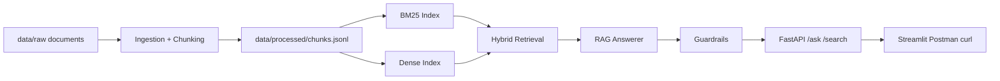
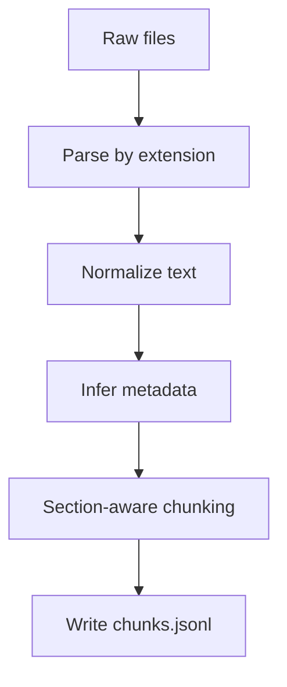
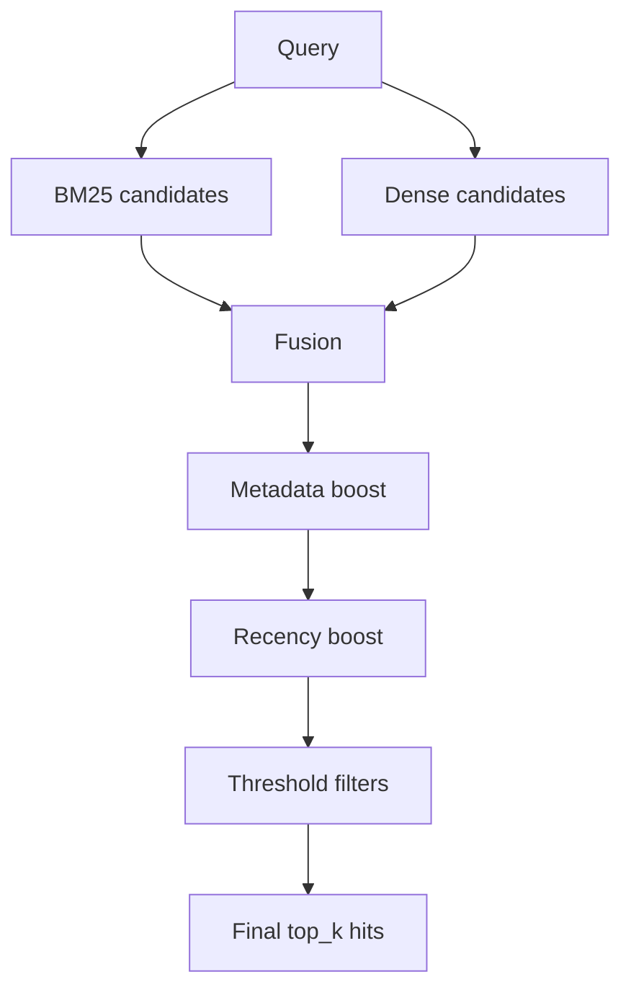
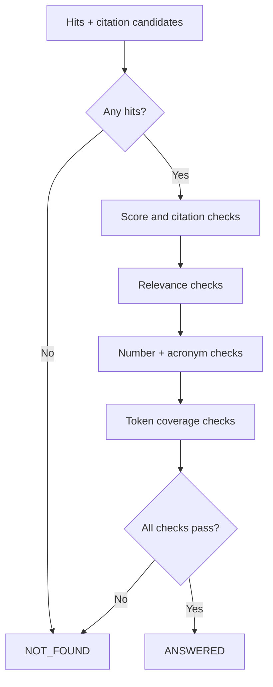
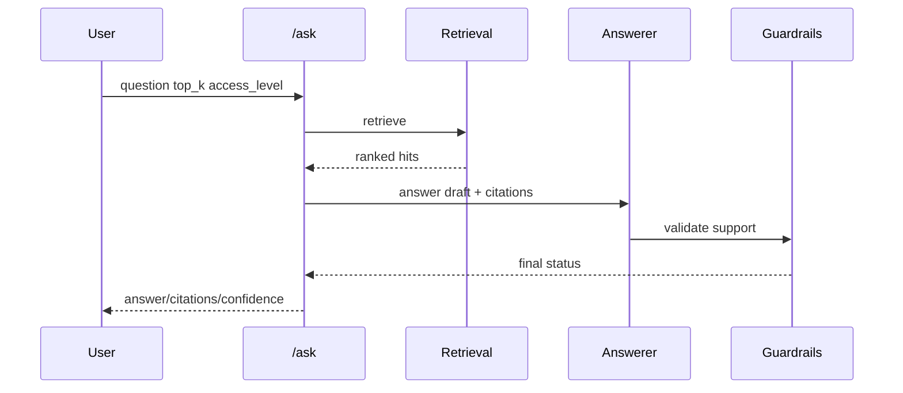

# Vietnamese Internal Docs RAG Assistant
## Detailed Technical Project Report

**Project Type:** Local-first Retrieval-Augmented Generation (RAG) QA System  
**Repository:** `vietnamese-internal-doc-rag-assistant`  
**Prepared For:** Academic project reporting and technical evaluation  
**Prepared On:** March 3, 2026

---

## 1. Executive Summary

This project implements a production-minded, local-first Vietnamese question-answering assistant for internal enterprise policy documents. The system combines document ingestion, chunk-based indexing, hybrid retrieval (BM25 + dense), response generation, and strict guardrails to ensure answers are grounded in evidence.

The core design goal is not only to answer questions, but to answer safely: if evidence is weak or unsupported, the system returns `NOT_FOUND` instead of hallucinating. This behavior is enforced through retrieval thresholds, citation filtering, and domain-specific guardrail checks.

The implementation includes a complete end-to-end pipeline with API endpoints, UI, automated evaluation scripts, manual scenario tests, and technical documentation.

---

## 2. Problem Statement

Internal policy knowledge is usually distributed across multiple departments and documents (HR, Engineering, Security, Operations). In practice:

- Manual search is slow and inconsistent.
- Users may miss the latest or correct policy section.
- Ungrounded LLM answers can sound correct but be factually unsupported.

The project addresses this by building a retrieval-grounded QA assistant that:

1. Retrieves relevant evidence from internal corpus.
2. Returns answers with explicit citations.
3. Refuses unsupported queries with clear fallback behavior.

---

## 3. Project Objectives

Primary objectives:

1. Build a complete local QA pipeline from raw documents to API responses.
2. Support multiple internal document formats (PDF/DOCX/MD/HTML/TXT).
3. Improve retrieval robustness using hybrid lexical + semantic search.
4. Enforce strict anti-hallucination policy via guardrails.
5. Provide reproducible evaluation and verification workflow.

Success criteria:

- Stable end-to-end runtime under default offline-first settings.
- Correct `ANSWERED`/`NOT_FOUND` behavior in manual and automated checks.
- Traceable citations for supported responses.

---

## 4. Scope and Boundaries

### 4.1 In Scope

- Ingestion and normalization pipeline.
- Section-aware chunking and metadata generation.
- BM25 and dense indexing.
- Hybrid retrieval with boosts and thresholds.
- RAG answer packaging with citations.
- Guardrail policy and confidence logic.
- FastAPI endpoints (`/health`, `/search`, `/ask`).
- Streamlit UI for interactive QA.
- Evaluation and error-analysis scripts.

### 4.2 Out of Scope (Current Stage)

- Enterprise authentication/SSO integration.
- Full observability stack (tracing, dashboards, alerting).
- Production deployment hardening and SLO operations.

---

## 5. End-to-End System Architecture

Architecture rationale:

- Build-time and run-time responsibilities are separated.
- Retrieval is decoupled from answer generation.
- Guardrails are a mandatory decision layer before response output.

---

## 6. Data Pipeline and Knowledge Preparation

### 6.1 Ingestion Flow

Implemented behaviors:

- Supported formats: `.pdf`, `.docx`, `.md`, `.markdown`, `.txt`, `.html`, `.htm`.
- Text normalization includes Unicode normalization and whitespace cleanup.
- Metadata inferred from file naming conventions:
  - `department`
  - `access_level`
  - `updated_at`

### 6.2 Chunking Strategy

- Section extraction from markdown headings.
- Token-window chunking with overlap.
- Deterministic `chunk_id` generation for reproducibility.

Current tradeoff:

- Token-window chunking is robust and simple but not strictly sentence-boundary-aware.

---

## 7. Indexing and Retrieval Design

### 7.1 Indexing Layer

- **BM25 Index (lexical):** strong for exact terms, acronyms, numeric phrases.
- **Dense Index (semantic):** default hash embeddings (`hash://384`) with optional transformer backend.

Artifacts:

- `data/indices/bm25.pkl`
- `data/indices/dense/embeddings.npy`
- `data/indices/dense/chunks.jsonl`
- `data/indices/dense/meta.json`

### 7.2 Hybrid Retrieval Logic

Key technical details:

- Weighted fusion with query-aware lexical/dense reweighting.
- Metadata and recency boosts applied after initial fusion.
- Post-filtering by score, relative rank, and token overlap.

---

## 8. RAG Answering and Guardrails

### 8.1 Answering Layer

Default profile uses `llm_backend = heuristic`.

- Generates response bullets from selected evidence chunks.
- Returns citation candidates for each evidence item.
- Optional transformer path exists but is not baseline.

### 8.2 Guardrail Decision Layer

Guardrails enforce:

- Confidence based on evidence strength and citation coverage.
- Strict refusal on unsupported claims.
- Specialized checks for yes/no framing, numbers, acronyms, and coverage consistency.

---

## 9. API Contract and Runtime Behavior

Implemented endpoints:

- `GET /health`
- `POST /search`
- `POST /ask`

Response policy:

- `/ask` returns strictly `ANSWERED` or `NOT_FOUND`.
- `debug` mode provides retrieval and threshold traces.

Typical `/ask` lifecycle:

---

## 10. Evaluation Methodology and Results

### 10.1 Methodology

Evaluation combines:

- Retrieval metrics: Recall@k, MRR, evidence hit rate.
- No-answer metrics: precision, recall, F1.
- Error analysis via holdout report and failure buckets.

### 10.2 Verified Baseline (default config)

From documented run (`scripts/run_eval.py`):

- BM25: Recall@5 `1.0`, MRR `0.9778`
- Dense (hash): Recall@5 `0.1222`, MRR `0.0526`
- Hybrid: Recall@5 `1.0`, MRR `0.9944`
- No-answer precision/recall/F1: `1.0 / 1.0 / 1.0`

Interpretation:

- Hybrid retrieval is the strongest and most stable mode.
- Dense hash backend alone is semantically weaker than lexical or hybrid.
- Guardrail refusal behavior is currently conservative and consistent.

---

## 11. Quality Assurance and Validation

Validation layers include:

1. Unit/integration tests in `tests/`.
2. Manual checklist with 20 scenarios.
3. One-command pipeline verification (`scripts/verify_pipeline.py`).

Coverage themes:

- Chunk determinism and metadata indexing.
- Retrieval fusion behavior.
- API contract validation.
- End-to-end status correctness (`ANSWERED` vs `NOT_FOUND`).

---

## 12. Key Technical Improvement Case (Robustness)

A practical false-refusal case was observed for conversational Vietnamese phrasing around branch naming. Root causes were relevance brittleness and metadata dilution. The fix introduced:

- Dynamic overlap behavior in guardrail scoring.
- Metadata relevance comparison using best-of multiple views.

Outcome:

- Conversational section queries became stable while preserving safety constraints.

This demonstrates iterative engineering: diagnose via debug traces, modify scoring logic, add regression tests, and re-validate full suite.

---

## 13. SWOT Analysis

### Strengths

- Complete end-to-end architecture with clear separation of concerns.
- Hybrid retrieval combines lexical precision and semantic coverage.
- Citation-grounded outputs and strict refusal policy reduce hallucination risk.
- Offline-first reproducible baseline for classroom/demo environments.

### Weaknesses

- Dense semantic quality is limited under hash embedding default.
- Chunking is not sentence-boundary-aware.
- Conservative guardrails may reject some borderline valid queries.

### Opportunities

- Upgrade dense embeddings while preserving reproducibility.
- Sentence-aware chunk packing experiments.
- Better observability and calibration dashboards.
- Broader external validation datasets.

### Threats

- Policy domain drift can degrade retrieval over time.
- Over-tight thresholds reduce answer coverage; over-loose thresholds raise hallucination risk.
- Production constraints (auth/compliance/ops) may require architecture extensions.

---

## 14. Limitations and Future Work

Short-term:

1. Improve dense retrieval quality and compare against stronger local embedding models.
2. Refine guardrail calibration to reduce residual false refusals.
3. Add finer telemetry for refusal reasons and fallback behavior.

Mid-term:

1. Improve production-readiness with structured observability.
2. Add deployment hardening and CI quality gates.

Long-term:

1. Enterprise-grade access governance and auditability.
2. Expanded evaluation on realistic, evolving internal corpora.

---

## 15. Conclusion

This project delivers a coherent, technically sound RAG assistant for Vietnamese internal policy QA with strong emphasis on reliability and explainability. The system is not just a retrieval demo; it is a guarded, evaluable, and reproducible pipeline that balances answer coverage with safety.

For academic evaluation, the implementation demonstrates:

- end-to-end system design,
- measurable retrieval and refusal behavior,
- practical debugging and iterative improvement,
- and clear path toward production-grade extension.

