# Project Technical Reference and Diagrams

This document is the canonical deep technical reference for the Vietnamese Internal Docs RAG Assistant.
It focuses on implementation internals, data flow, and architecture-level reasoning.

## 1. Project Purpose and System Boundaries

This system answers questions about internal policy documents by combining retrieval and guardrailed answer generation.

Core purpose:
- Return grounded answers with citations from internal documents.
- Refuse unsupported questions with explicit `NOT_FOUND` behavior.
- Support local-first operation with deterministic indexing and reproducible evaluation.

System boundary (in scope):
- Document ingestion and chunking.
- BM25 and dense indexing.
- Hybrid retrieval, answer packaging, and guardrails.
- FastAPI endpoints and Streamlit UI.
- Evaluation and error analysis scripts.

Out-of-scope for current baseline:
- Enterprise-grade auth/IAM integration.
- Full production observability stack.
- Deployment SLO and autoscaling hardening.

Implementation references:
- `README.md`
- `IMPLEMENTATION_GUIDE.md`
- `src/app/service.py`
- `src/api/app.py`

## 2. End-to-End Architecture (build-time + run-time)

### Global Architecture

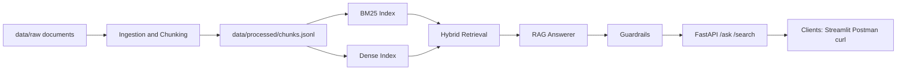

The system has two major phases:
- Build-time: transform raw documents into chunk and index artifacts.
- Run-time: retrieve evidence for a question, produce answer text, then enforce guardrail checks.

### Build-Time Flow

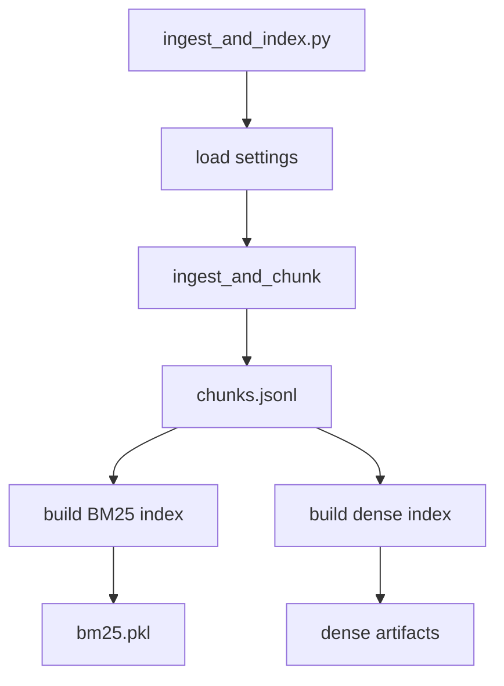

Build artifacts are consumed directly by runtime service initialization.

### /ask Runtime Sequence

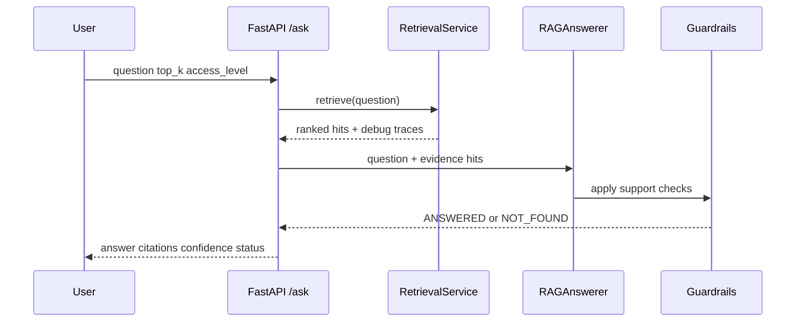

Implementation references:
- `scripts/ingest_and_index.py`
- `src/ingestion/pipeline.py`
- `src/indexing/build_indices.py`
- `src/app/service.py`

## 3. Repository and Module Map (folder-to-responsibility mapping)

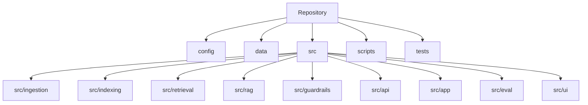

### Subsystem Cross-Reference Table

| Subsystem | Responsibility | Primary files |
| --- | --- | --- |
| Config | Runtime defaults and validation | `config/default.yaml`, `src/config/settings.py` |
| Ingestion | Parse, normalize, metadata inference | `src/ingestion/parsers.py`, `src/ingestion/cleaning.py`, `src/ingestion/pipeline.py` |
| Chunking | Section extraction and token windows | `src/indexing/chunker.py` |
| Indexing | Build and persist BM25 and dense artifacts | `src/indexing/bm25_index.py`, `src/indexing/dense_index.py`, `src/indexing/build_indices.py` |
| Retrieval | Retrieve and fuse BM25+dense candidates | `src/retrieval/bm25_retriever.py`, `src/retrieval/dense_retriever.py`, `src/retrieval/hybrid.py`, `src/retrieval/service.py` |
| Answering | Build answer text + citation candidates | `src/rag/local_llm.py`, `src/rag/prompt.py`, `src/rag/answerer.py` |
| Guardrails | Confidence and refusal logic | `src/guardrails/policy.py` |
| API and app | Request orchestration and contracts | `src/api/app.py`, `src/api/models.py`, `src/app/service.py` |
| Evaluation | Metrics and evaluation loop | `src/eval/run_eval.py`, `src/eval/metrics.py`, `scripts/holdout_error_report.py` |
| UI | Interactive QA and debug view | `src/ui/streamlit_app.py` |

Implementation references:
- `README.md`
- `SYSTEM_DIAGRAMS_AND_LEARNING_CURVE.md`

## 4. Runtime Profile and Configuration Model (`config/default.yaml` driven behavior)

Current default profile emphasizes reproducibility and local stability.

Key defaults:
- `models.llm_backend = heuristic`
- `models.embedding_model_name = hash://384`
- `retrieval.fusion_method = weighted`
- `retrieval.lexical_weight = 0.62`
- `retrieval.dense_weight = 0.38`
- `retrieval.default_top_k = 5`
- `guardrails.max_citations = 3`

Configuration loading behavior:
- Required path keys are validated at load time.
- Optional keys are defaulted in code when missing.
- Directory paths are created before run.

Risk note:
- Retrieval/guardrail thresholds are tuned jointly; isolated edits can shift refusal behavior.

Implementation references:
- `config/default.yaml`
- `src/config/settings.py`
- `TUNING_NOTES.md`

## 5. Ingestion Pipeline Internals (parse, normalize, metadata inference)

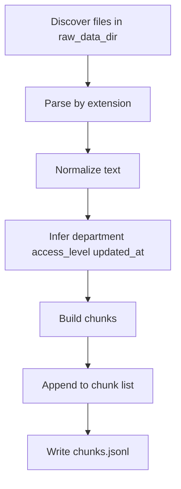

Ingestion behavior details:
- Supported extensions: `.pdf`, `.docx`, `.md`, `.markdown`, `.txt`, `.html`, `.htm`.
- Parsing backends:
  - PDF via `pypdf`
  - DOCX via `docx2txt`
  - text-like files via UTF-8 read
- Normalization:
  - Unicode NFC normalization
  - null-byte removal
  - whitespace compaction and empty-line filtering
- Metadata inferred from filename:
  - `department`
  - `access_level`
  - `updated_at`

Output:
- In-memory `DocumentChunk` list
- persisted JSONL at configured chunk output path

Implementation references:
- `src/ingestion/parsers.py`
- `src/ingestion/cleaning.py`
- `src/ingestion/pipeline.py`
- `src/common/io.py`

## 6. Chunking Internals (section extraction, overlap windows, chunk identity)

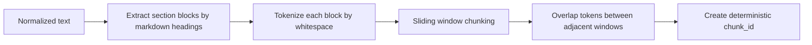

Chunking behavior details:
- Section paths are derived from heading stack hierarchy.
- Fallback section path is `General` if no heading structure exists.
- Windowing uses:
  - `chunk_size_tokens`
  - `overlap_tokens`
  - step = `chunk_size_tokens - overlap_tokens`
- Deterministic chunk identity format:
  - `{doc_id}-{index}-{digest}`
- Determinism is validated in unit tests.

Implementation references:
- `src/indexing/chunker.py`
- `src/common/schemas.py`
- `tests/test_chunker.py`

## 7. Indexing Internals (BM25 index, dense index, artifact formats)

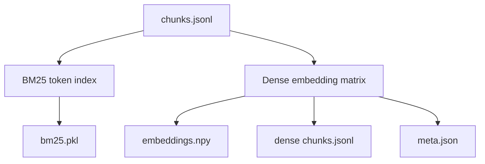

BM25 indexing characteristics:
- Index text fields: `title + section_path + text`.
- Token normalization includes alias mapping for selected terms.
- Uses `rank_bm25` when available, with fallback scoring path.

Dense indexing characteristics:
- Default embeddings: hash backend (`hash://384`).
- Optional transformer embeddings if model loading succeeds.
- Optional FAISS acceleration if available.

Artifact contract:
- BM25 artifact: single pickle file.
- Dense artifact folder:
  - embedding matrix
  - chunk rows
  - embedding metadata

Implementation references:
- `src/indexing/build_indices.py`
- `src/indexing/bm25_index.py`
- `src/indexing/dense_index.py`

## 8. Retrieval Pipeline Internals (BM25+dense fusion, boosts, filtering)

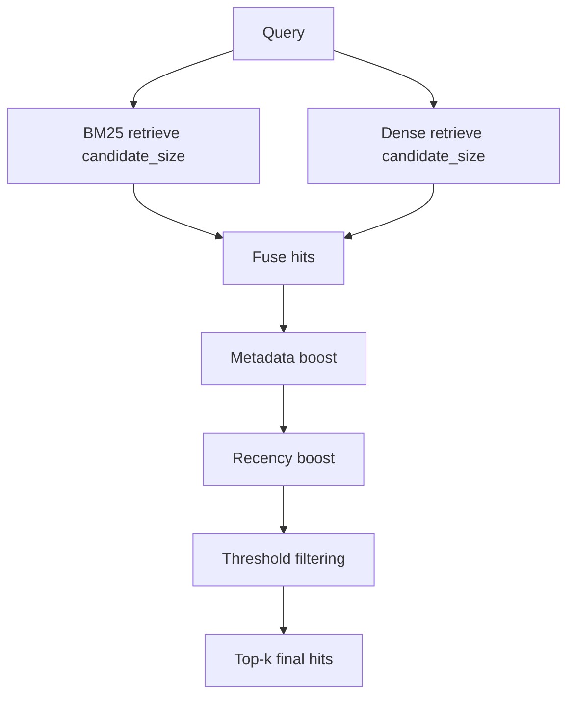

Retrieval behavior details:
- Candidate pool size dynamically scales with request `top_k`.
- Query-aware lexical/dense weight adjustment is applied.
- Post-fusion refinement includes:
  - metadata boost
  - recency boost
  - score/relative/overlap thresholds
- Access control filtering happens during retriever calls using `access_level`.

Debug payload includes:
- BM25 top candidates
- dense top candidates
- fusion weights and candidate size
- active thresholds

Implementation references:
- `src/retrieval/service.py`
- `src/retrieval/hybrid.py`
- `src/retrieval/bm25_retriever.py`
- `src/retrieval/dense_retriever.py`

## 9. RAG Answering and Citation Pipeline

The answering layer transforms retrieved hits into a final answer package.

Processing stages:
- Prompt assembly from question and evidence hits.
- Local LLM wrapper generation (`heuristic` by default).
- Citation candidate filtering by relevance and structure alignment.
- Confidence computation from top evidence strength and citation coverage.
- Final answer text assembly from selected evidence snippets.

Heuristic-mode behavior:
- Uses selected hits to produce concise bullet answer text.
- Extracts up to two sentence segments per selected hit snippet.
- Falls back to `NOT_FOUND` if support is empty or filtered out.

Implementation references:
- `src/rag/prompt.py`
- `src/rag/local_llm.py`
- `src/rag/answerer.py`
- `src/guardrails/policy.py`

## 10. Guardrail Decision Engine (checks, thresholds, refusal logic)

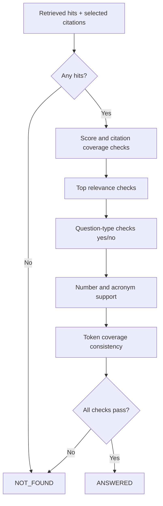

Guardrail behavior details:
- Enforces hard refusal when evidence quality is weak.
- Uses both text relevance and metadata relevance signals.
- Applies specialized checks for:
  - yes/no question framing
  - numeric claim support
  - acronym support
  - open-query token coverage
  - top-document support consistency

Recent robustness behavior:
- Dynamic overlap scoring reduces sensitivity to conversational filler phrasing.
- Metadata relevance uses max of title/section/combined views.

Implementation references:
- `src/guardrails/policy.py`
- `src/rag/answerer.py`
- `tests/test_guardrails.py`
- `tests/test_answerer.py`

## 11. API Contract and Request Lifecycles (`/health`, `/search`, `/ask`)

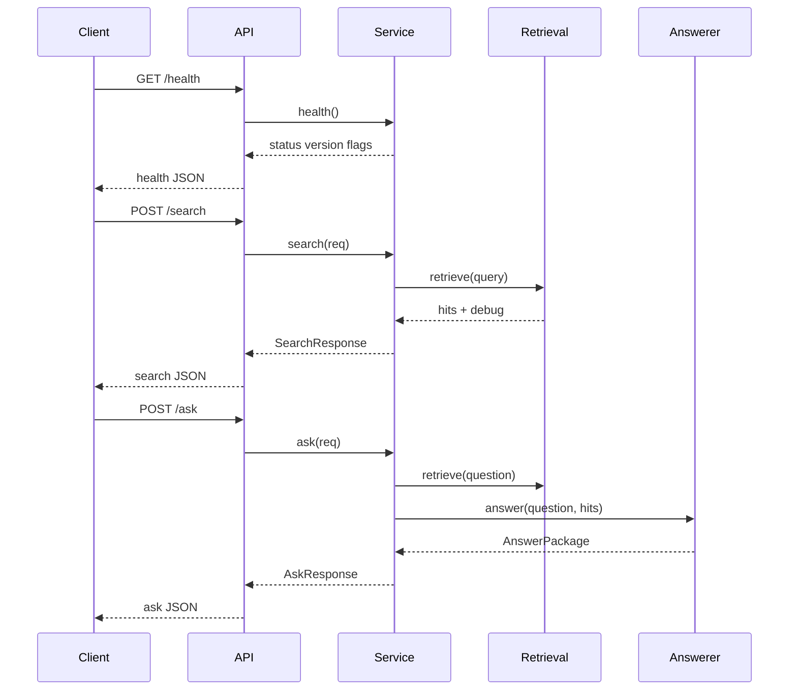

Contract details:
- Input validation via pydantic models.
- `top_k` has bounded range and defaults.
- Status outputs for `/ask` are strictly `ANSWERED` or `NOT_FOUND`.
- Debug payload is optional and endpoint-specific.

Implementation references:
- `src/api/models.py`
- `src/api/app.py`
- `src/app/service.py`
- `tests/test_api_contract.py`

## 12. Evaluation and Tuning Loop (metrics, scripts, error buckets)

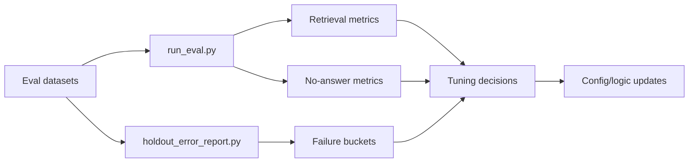

Evaluation surfaces:
- Retrieval metrics:
  - Recall@k
  - MRR
  - evidence hit rate
- No-answer quality:
  - precision
  - recall
  - F1
- Error buckets:
  - retrieval miss
  - false refusal
  - hallucination-risk patterns

Purpose of loop:
- Convert observed failure groups into targeted changes in retrieval and guardrails.

Implementation references:
- `src/eval/run_eval.py`
- `src/eval/metrics.py`
- `scripts/run_eval.py`
- `scripts/holdout_error_report.py`
- `TUNING_NOTES.md`

## 13. Reliability and Debugging Playbook (common failure classes and diagnosis flow)

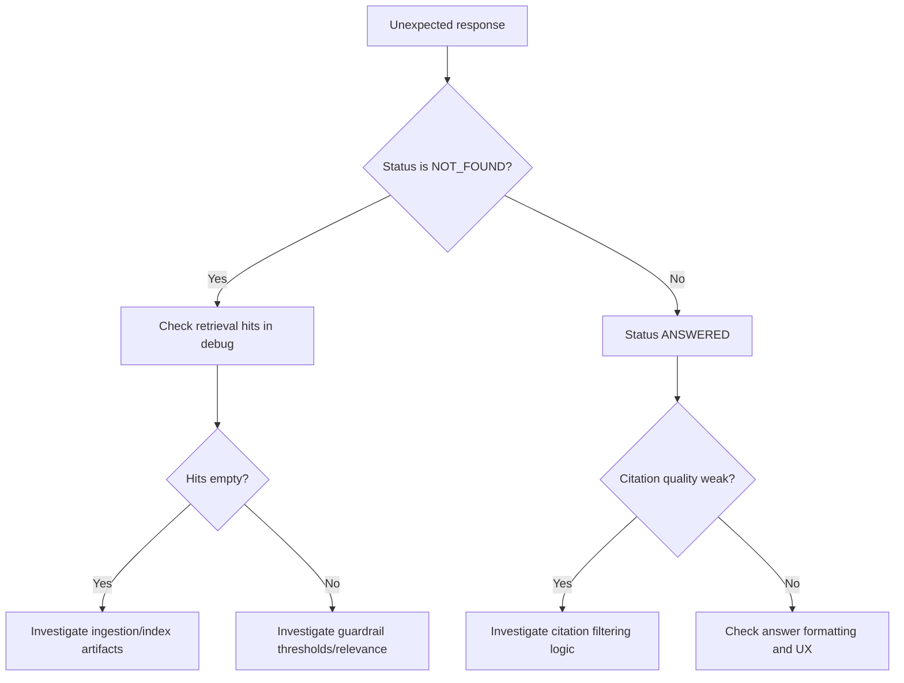

### Symptom-to-Component Mapping

| Symptom | Likely component | First files to inspect |
| --- | --- | --- |
| Expected policy not found in any hit | Ingestion/chunking/index build | `src/ingestion/pipeline.py`, `src/indexing/chunker.py`, `src/indexing/build_indices.py` |
| Correct hit exists but response is `NOT_FOUND` | Guardrail thresholding | `src/rag/answerer.py`, `src/guardrails/policy.py` |
| Restricted content appears for low access | Access filter logic | `src/indexing/bm25_index.py`, `src/indexing/dense_index.py`, `src/retrieval/service.py` |
| Irrelevant citations in answer | Citation filtering | `src/guardrails/policy.py`, `src/rag/answerer.py` |
| `/ask` validation failure | API request schema | `src/api/models.py`, `src/api/app.py` |
| Search and ask disagree unexpectedly | Service orchestration | `src/app/service.py`, `src/retrieval/service.py` |

Debug-first workflow:
- Start from endpoint debug payload.
- Determine if failure is retrieval-side or guardrail-side.
- Trace to component-specific files and rerun targeted tests.

Implementation references:
- `src/ui/streamlit_app.py`
- `src/app/service.py`
- `tests/test_end_to_end.py`
- `scripts/verify_pipeline.py`

## 14. Known Limitations and Productionization Roadmap

Current limitations:
- Dense retrieval with hash embeddings is reproducible but semantically weaker than transformer embeddings.
- Guardrails intentionally prioritize safety, which can still cause borderline false refusals.
- Authentication/authorization is metadata-based, not enterprise IAM integrated.
- Production observability and deployment SLO enforcement are not fully implemented.

Roadmap direction:
- Improve dense semantic quality while preserving reproducibility constraints.
- Add richer telemetry around refusal reasons and fallback paths.
- Harden deployment with structured monitoring and operational guardrails.
- Introduce stronger enterprise access/governance controls.

Implementation references:
- `TUNING_NOTES.md`
- `IMPLEMENTATION_GUIDE.md`
- `README.md`
