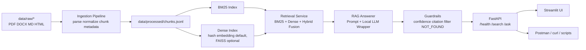
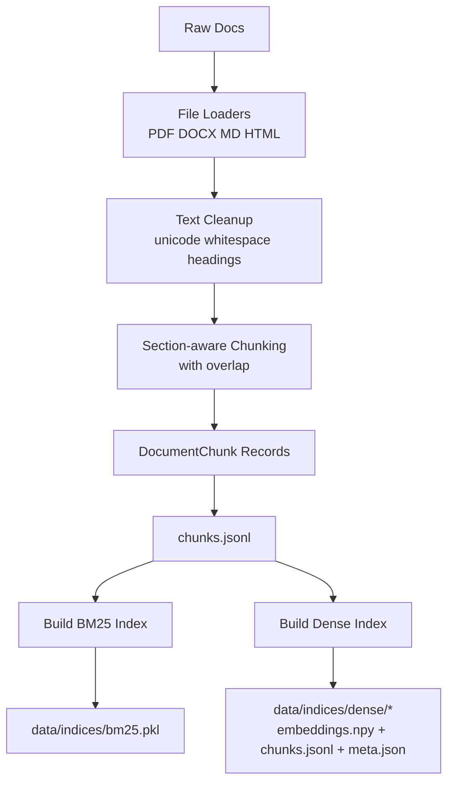
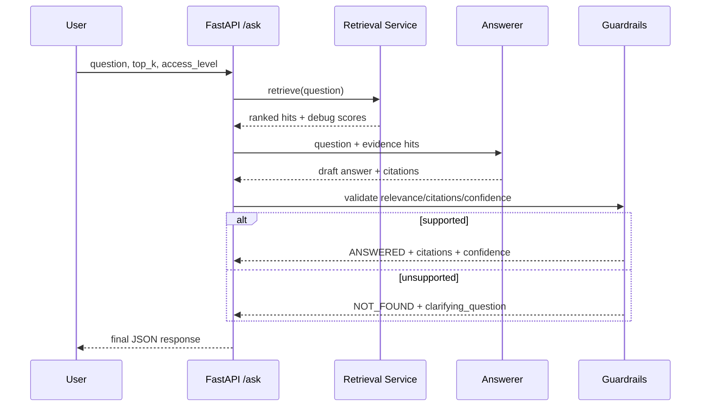
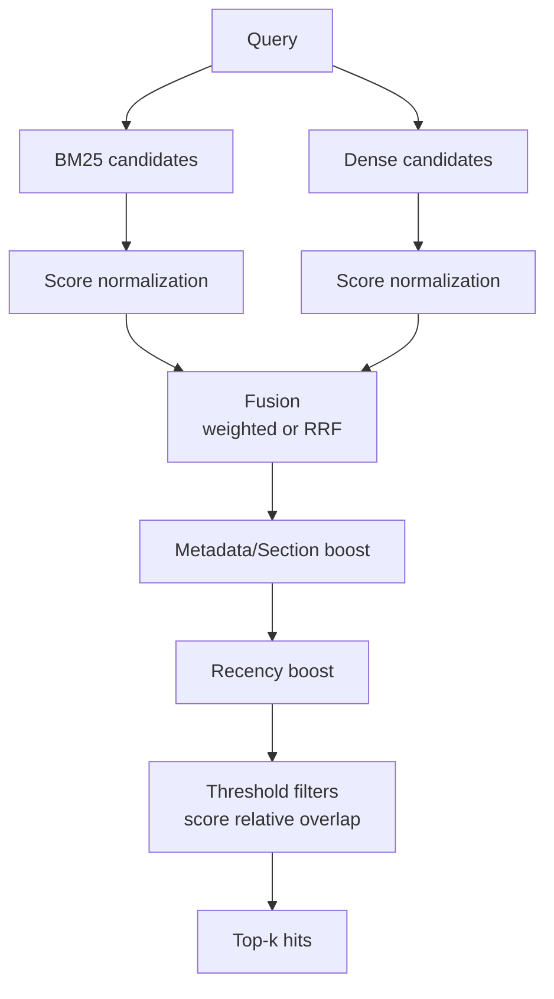
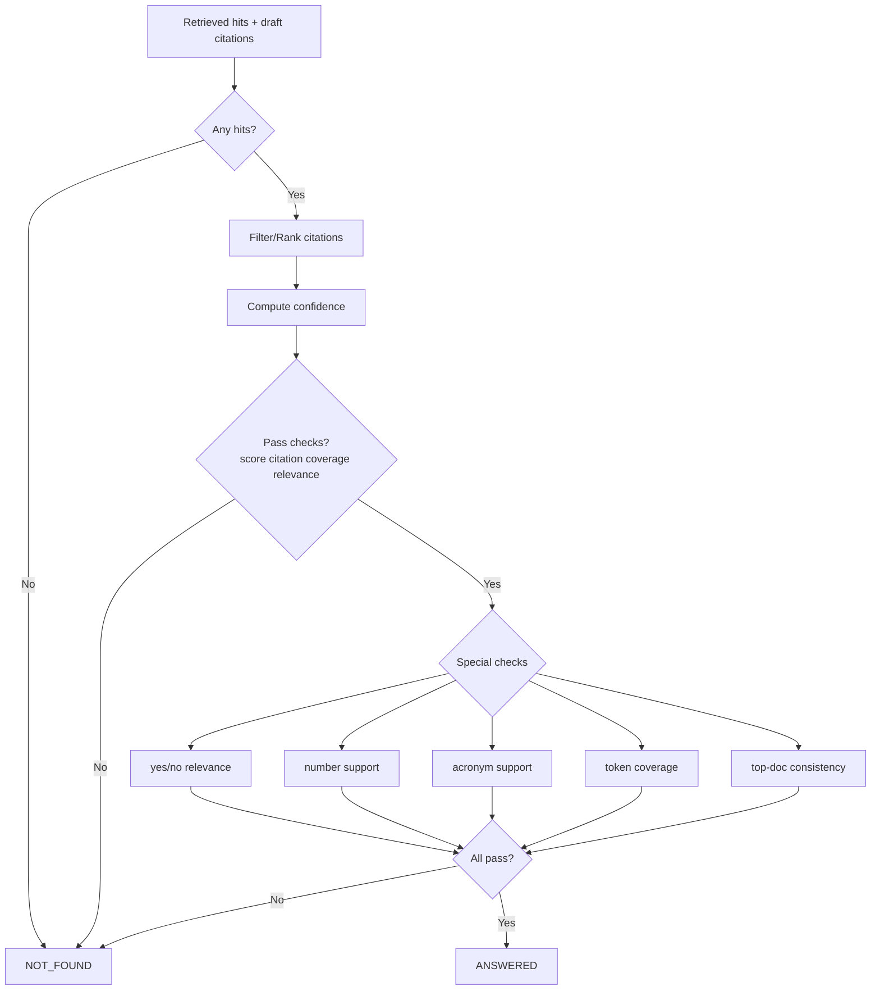
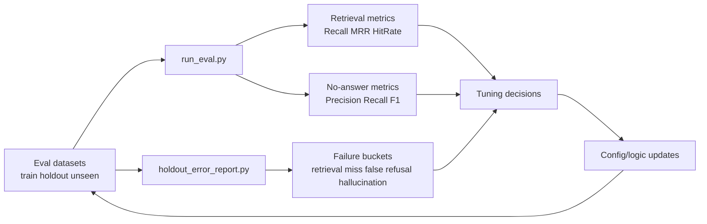

# System Diagrams and Learning Curve

This document explains the current Vietnamese Internal Docs RAG Assistant with visual diagrams and a student-friendly learning path.

Current default runtime profile:

- `llm_backend = heuristic`
- `embedding_model_name = hash://384`
- Optional `transformers` backend exists but is not the default.

## 1) End-to-End Architecture

## 2) Ingestion and Indexing Flow

## 3) Query Lifecycle (/ask)

## 4) Hybrid Retrieval Logic (Simplified)

## 5) Guardrail Decision (Simplified)

## 6) Evaluation and QA Loop

## 7) Student Learning Curve

Use this as a practical learning roadmap.

## Level 0 (Day 1): What problem are we solving?

- Goal: Understand RAG at a high level.
- Learn:
  - Why plain LLM answers can hallucinate.
  - Why retrieval + citations improve trust.
  - Difference between `ANSWERED` vs `NOT_FOUND`.
- Output you should be able to explain:
  - "The system answers only from internal documents and cites evidence."

## Level 1 (Days 2-3): Data and chunk basics

- Goal: Understand how raw documents become searchable units.
- Learn:
  - `data/raw` -> parsing/cleaning -> chunking -> `chunks.jsonl`.
  - Chunk fields (`doc_id`, `chunk_id`, `title`, `section_path`, `access_level`).
- Practice:
  - Add one small markdown policy doc.
  - Re-run `scripts/ingest_and_index.py`.
  - Confirm new chunks in `data/processed/chunks.jsonl`.

## Level 2 (Days 4-5): Retrieval fundamentals

- Goal: Understand BM25, dense retrieval, and hybrid fusion.
- Learn:
  - Lexical vs semantic retrieval.
  - Why hybrid usually beats a single retriever.
  - Key knobs in `config/default.yaml` (weights, thresholds).
- Practice:
  - Run `/search` with `debug=true`.
  - Compare BM25 and dense top hits for the same query.

## Level 3 (Days 6-7): Answer generation and citations

- Goal: Understand how `/ask` builds answer packages.
- Learn:
  - Prompt + local model wrapper (`heuristic` default).
  - Citation selection from retrieved hits.
  - Why answer text may include multiple bullets.
- Practice:
  - Use Postman collection `S01-S04`.
  - Check each answer has relevant citation `chunk_id`s.

## Level 4 (Week 2): Guardrails and safety behavior

- Goal: Understand when/why system refuses to answer.
- Learn:
  - Confidence logic.
  - Unsupported query handling (`NOT_FOUND`).
  - Extra checks (yes/no, numbers, acronym support, token coverage).
- Practice:
  - Run `S05-S11` and explain every `NOT_FOUND` decision using `debug` fields.

## Level 5 (Week 3): Evaluation-driven engineering

- Goal: Learn how to tune with metrics, not intuition.
- Learn:
  - Retrieval metrics (Recall@k, MRR, hit rate).
  - No-answer metrics (precision/recall/F1).
  - Failure group analysis.
- Practice:
  - Run:
    - `scripts/run_eval.py`
    - `scripts/holdout_error_report.py`
  - Pick one failure group and propose one targeted fix.

## Level 6 (Week 4+): MVP-to-production thinking

- Goal: Know what is still missing for production.
- Learn:
  - Monitoring/observability, auth, rate limiting, deployment reliability.
  - Regression strategy and external validation datasets.
- Practice:
  - Write a short "production readiness checklist" for this project.

## 8) Suggested Study Order (Fast Track)

1. Read `README.md` and run the system once.
2. Open this file and follow diagrams 1 -> 5.
3. Execute Postman scenarios `S01-S11`.
4. Run eval + error report scripts.
5. Read `TUNING_NOTES.md` to connect changes to metrics.

## 9) Knowledge Area Assignment (4 Members)

Use this split so each member becomes a clear owner of one major subsystem.
Replace `Member A-D` with real names.

| Member | Primary knowledge area | Main files/components | Expected outputs |
| --- | --- | --- | --- |
| Member A | Data ingestion and indexing | `src/ingestion/*`, `src/indexing/*`, `scripts/ingest_and_index.py`, `tests/test_chunker.py`, `tests/test_indexing_metadata.py` | Stable chunk pipeline, reproducible index build, ingestion/index bug fixes |
| Member B | Retrieval and ranking | `src/retrieval/*`, `src/indexing/bm25_index.py`, `src/indexing/dense_index.py`, `config/default.yaml`, `tests/test_hybrid.py`, `tests/test_retrieval_tuning.py` | Better top-k quality, tuned hybrid weights/thresholds, retrieval debug analysis |
| Member C | Answer generation and guardrails | `src/rag/*`, `src/guardrails/*`, `tests/test_guardrails.py`, `tests/test_end_to_end.py` | Better answer quality with valid citations, stronger `NOT_FOUND` behavior, reduced hallucination risk |
| Member D | API, evaluation, and product QA | `src/api/*`, `src/ui/streamlit_app.py`, `src/eval/*`, `scripts/run_eval.py`, `scripts/holdout_error_report.py`, `tests/test_api_contract.py` | Reliable API behavior, updated eval reports, demo-ready UI/manual test evidence |

### Cross-training rule (to avoid single-point ownership)

- Member A secondary area: Retrieval and ranking (Member B).
- Member B secondary area: Data ingestion and indexing (Member A).
- Member C secondary area: API, evaluation, and QA (Member D).
- Member D secondary area: Answer generation and guardrails (Member C).

### Suggested cadence

- Week 1: Each member masters their primary area and documents 1 onboarding note.
- Week 2: Each member fixes at least 1 bug and adds/updates at least 1 test in their area.
- Week 3: Pair on secondary area and submit 1 cross-area improvement.
- Week 4: Run full integration test and finalize demo checklist.
